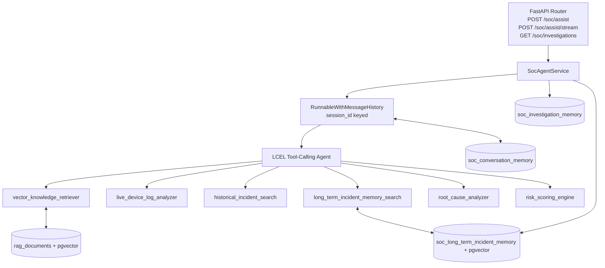

# TrustSeal Structured Memory Architecture (FastAPI + LCEL + pgvector)

This document defines the production-ready memory architecture for TrustSeal SOC Intelligence with:
- Short-term conversational memory
- Investigation session memory (audit trail)
- Long-term incident memory (self-learning)

The design is async endpoint compatible and aligned with current service modules:
- `backend/app/services/soc_agent/service.py`
- `backend/app/services/soc_agent/memory.py`
- `backend/app/services/soc_agent/tools.py`
- `backend/app/services/soc_agent/prompts.py`

## 1) Updated Architecture Diagram



## 2) Memory Layer Design

### A. Short-Term Conversational Memory
- Mechanism: `RunnableWithMessageHistory`.
- Store: `soc_conversation_memory`.
- Key: `session_id`.
- Behavior:
1. Load prior messages for `session_id` before each run.
2. Append user and assistant messages after each run.
3. Support sync and streaming agent paths.

### B. Investigation Session Memory (Audit Trail)
- Store: `soc_investigation_memory`.
- Write timing: after a completed investigation response.
- Required fields:
1. `device_id`
2. `anomaly_type`
3. `tools_used`
4. `reasoning_steps`
5. `root_cause_conclusion`
6. `risk_level`
7. `timestamp`
- Read path: reporting endpoint (`GET /soc/investigations`) with optional `session_id`.

### C. Long-Term Incident Memory (Self-Learning Layer)
- Store: `soc_long_term_incident_memory`.
- Write timing: after investigation finalization.
- Flow:
1. Build structured summary from SOC result.
2. Generate embedding using embedding provider.
3. Persist summary + metadata + embedding in pgvector table.
- Query path:
1. `long_term_incident_memory_search` tool performs similarity retrieval.
2. Matched prior incidents are included in final response.

## 3) Database Schema Additions

PostgreSQL DDL (recommended via Alembic migration):

```sql
CREATE EXTENSION IF NOT EXISTS vector;

CREATE TABLE IF NOT EXISTS soc_conversation_memory (
    id BIGSERIAL PRIMARY KEY,
    session_id TEXT NOT NULL,
    message JSONB NOT NULL,
    created_at TIMESTAMPTZ NOT NULL DEFAULT NOW()
);

CREATE INDEX IF NOT EXISTS soc_conversation_memory_session_idx
ON soc_conversation_memory (session_id, created_at);

CREATE TABLE IF NOT EXISTS soc_investigation_memory (
    investigation_id TEXT PRIMARY KEY,
    session_id TEXT NOT NULL,
    device_id TEXT NULL,
    anomaly_type TEXT NOT NULL,
    tools_used JSONB NOT NULL DEFAULT '[]'::jsonb,
    reasoning_steps JSONB NOT NULL DEFAULT '[]'::jsonb,
    root_cause_conclusion TEXT NOT NULL,
    risk_level TEXT NOT NULL CHECK (risk_level IN ('low', 'medium', 'high', 'critical')),
    confidence_score DOUBLE PRECISION NOT NULL DEFAULT 0.5,
    created_at TIMESTAMPTZ NOT NULL DEFAULT NOW()
);

CREATE INDEX IF NOT EXISTS soc_investigation_memory_session_idx
ON soc_investigation_memory (session_id, created_at DESC);

CREATE TABLE IF NOT EXISTS soc_long_term_incident_memory (
    memory_id TEXT PRIMARY KEY,
    investigation_id TEXT NOT NULL,
    session_id TEXT NOT NULL,
    device_id TEXT NULL,
    anomaly_type TEXT NOT NULL,
    summary TEXT NOT NULL,
    root_cause TEXT NOT NULL,
    resolution TEXT NOT NULL,
    risk_level TEXT NOT NULL CHECK (risk_level IN ('low', 'medium', 'high', 'critical')),
    confidence_score DOUBLE PRECISION NOT NULL DEFAULT 0.5,
    metadata JSONB NOT NULL DEFAULT '{}'::jsonb,
    embedding vector(<RAG_EMBEDDING_DIM>) NOT NULL,
    created_at TIMESTAMPTZ NOT NULL DEFAULT NOW()
);

CREATE INDEX IF NOT EXISTS soc_long_term_incident_created_idx
ON soc_long_term_incident_memory (created_at DESC);

CREATE INDEX IF NOT EXISTS soc_long_term_incident_embedding_idx
ON soc_long_term_incident_memory
USING ivfflat (embedding vector_cosine_ops)
WITH (lists = 100);
```

Notes:
- Set vector dimension to your configured `RAG_EMBEDDING_DIM`.
- For very large memory stores, prefer periodic `ANALYZE` and tuned ivfflat/hnsw params.

## 4) Agent Integration Approach

### LCEL + Tool-Calling Agent Pattern
1. Build tools (RAG, logs, incident history, long-term memory, root cause, risk scoring).
2. Create tool-calling agent runnable.
3. Wrap with `RunnableWithMessageHistory` keyed by `session_id`.
4. Invoke via `ainvoke` or `astream_events` for streaming.

### Required Reasoning Order in Prompt
1. Understand question
2. Retrieve knowledge (RAG)
3. Analyze logs
4. Search historical incidents
5. Check long-term memory
6. Perform reasoning
7. Assign risk
8. Return structured SOC report

### Confidence Adjustment Using Memory Matches
Apply deterministic post-processing after parsing model JSON:
1. If `top_similarity >= 0.85` and root cause aligns, increase confidence by `+0.10` (cap at `0.98`).
2. If `0.70 <= top_similarity < 0.85`, increase by `+0.05`.
3. If `top_similarity >= 0.80` but root cause conflicts, decrease by `-0.10`.
4. Ensure final output includes matched `memory_id` and prior resolution comparison text.

This keeps behavior stable even when model tool-calling is imperfect.

## 5) Memory Flow Explanation

1. Admin sends request with `session_id` and optional telemetry logs.
2. Agent runtime loads prior chat messages from `soc_conversation_memory`.
3. Agent executes tools in SOC order, including long-term memory similarity search.
4. Agent returns structured SOC JSON with required sections.
5. Service parses and validates output.
6. Service writes audit trail to `soc_investigation_memory`.
7. Service builds long-term summary, embeds it, and writes to `soc_long_term_incident_memory`.
8. Next query in same `session_id` automatically reuses conversational history.
9. Future similar anomalies retrieve prior incidents and influence confidence.

## 6) Example FastAPI Route Integration (Async-Compatible)

```python
from typing import AsyncIterator

from fastapi import APIRouter, Depends
from fastapi.responses import StreamingResponse
from sqlalchemy.orm import Session

from ..database import get_db
from ..schemas.soc_agent import (
    InvestigationAuditListResponse,
    SocAssistRequest,
    SocInvestigationResponse,
)
from ..services.soc_agent import soc_agent_service
from ..services.soc_agent.memory import soc_memory_store

router = APIRouter()


@router.post("/soc/assist", response_model=SocInvestigationResponse)
async def soc_assist(payload: SocAssistRequest, db: Session = Depends(get_db)) -> SocInvestigationResponse:
    # LCEL call path: RunnableWithMessageHistory + tool-calling agent
    return await soc_agent_service.investigate(payload, db)


@router.post("/soc/assist/stream")
async def soc_assist_stream(payload: SocAssistRequest, db: Session = Depends(get_db)) -> StreamingResponse:
    async def stream() -> AsyncIterator[str]:
        async for chunk in soc_agent_service.stream_investigation(payload, db):
            yield chunk

    return StreamingResponse(
        stream(),
        media_type="text/event-stream",
        headers={"Cache-Control": "no-cache", "Connection": "keep-alive", "X-Accel-Buffering": "no"},
    )


@router.get("/soc/investigations", response_model=InvestigationAuditListResponse)
async def list_soc_investigations(session_id: str | None = None, limit: int = 50, db: Session = Depends(get_db)):
    records = soc_memory_store.list_investigation_memory(db=db, session_id=session_id, limit=limit)
    return InvestigationAuditListResponse(records=records)
```

## System Prompt (Recommended)

```text
You are TrustSeal SOC Intelligence.

You remember prior conversation context within the session.
You maintain investigation memory for auditing.
You consult historical incident memory before concluding root cause.

You do not guess.
You always verify using available tools.
You justify conclusions based on evidence.

Always respond in structured format:
1. Issue Summary
2. Investigation Steps Taken
3. Context Retrieved
4. Historical Memory Matches
5. Root Cause Analysis
6. Risk Level
7. Confidence Score
8. Recommended Action
```
